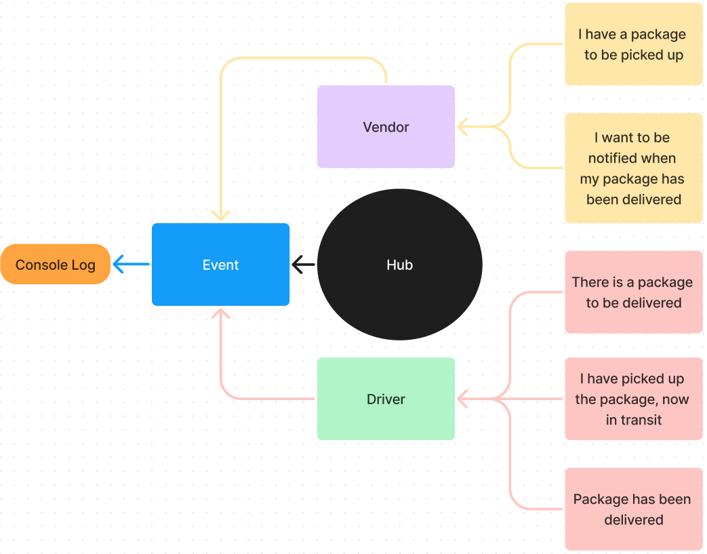
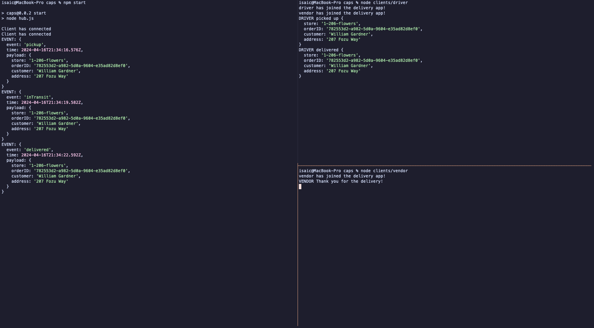

# caps

## Getting Started

### Requirements

For development, you will only need [Node](http://nodejs.org/) installed in your
environment.
Please use the appropriate [Editorconfig](http://editorconfig.org/) plugin for your
Editor (not mandatory).

### Install

    git clone git@github.com:Arvoya/caps.git
    cd PROJECT
    npm install

### Configure app

Any environment configuration steps.

### Start & watch

    npm run dev
    npm start

## Architecture

### Event Driven Applications



### Socket.io



```bash

├── .DS_Store
├── .eslintrc.json
├── .github
│   └── workflows
│       └── node.yml
├── .gitignore
├── LICENSE
├── README.md
├── assets
│   ├── .DS_Store
│   └── data-model.png
├── clients
│   ├── driver
│   │   ├── driver-handler.test.js
│   │   ├── handler.js
│   │   └── index.js
│   ├── socket.js
│   └── vendor
│       ├── handler.js
│       ├── index.js
│       └── vendor-hanlder.test.js
├── hub.js
├── package-lock.json
└── package.json
```

### Languages & tools

* JavaScript
* Jest
* Node
* Chance
* Nodemon
* socket.io
* socket.io-client

## Change Log

0.0.2 - Socket.io refactor

0.0.1 - Initial release
